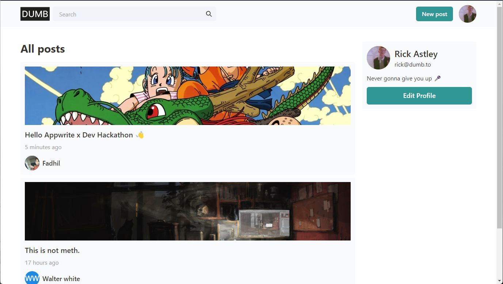
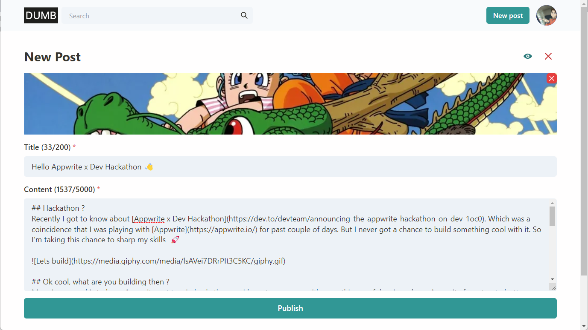
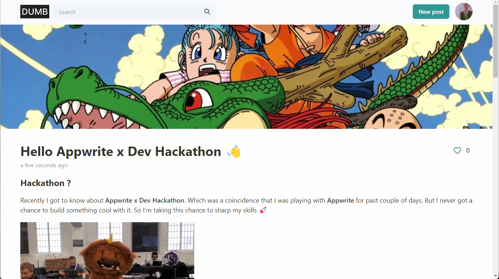
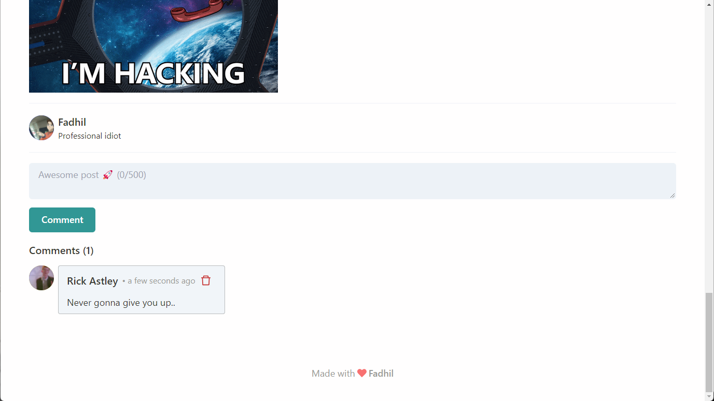
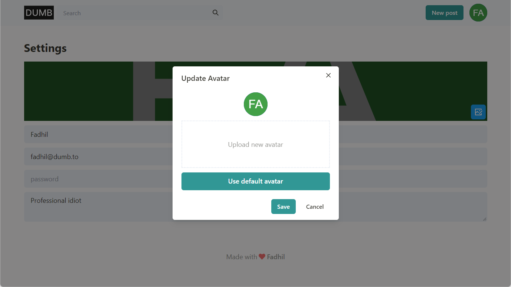
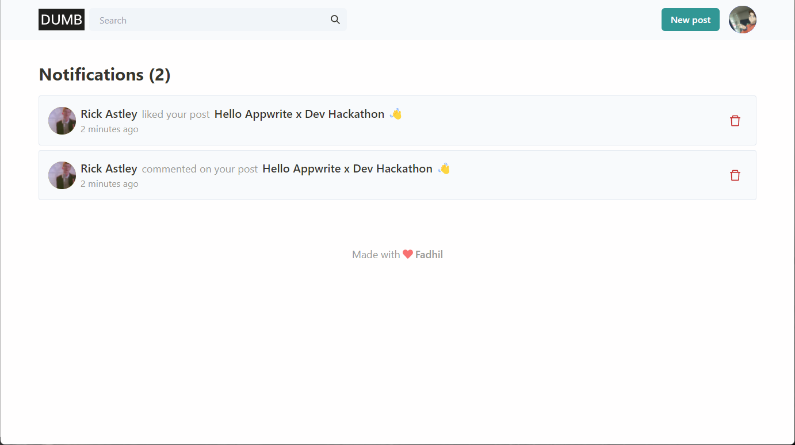

# Dumb.to

Dumb is a blogging app similar like dev.to made with Next JS & appwrite as backend.

## Features

- Users can create articles
- Like article
- Comment on article
- Author will get notified whenever someone like or comment on post
- Update profile

Check [how to setup](./installation.md).

> Its kinda hard to setup because IDK how to make it simpler.., if you have any doubt regarding installation feel free to email me fadhilsaheer@gmail.com

## Screenshots

